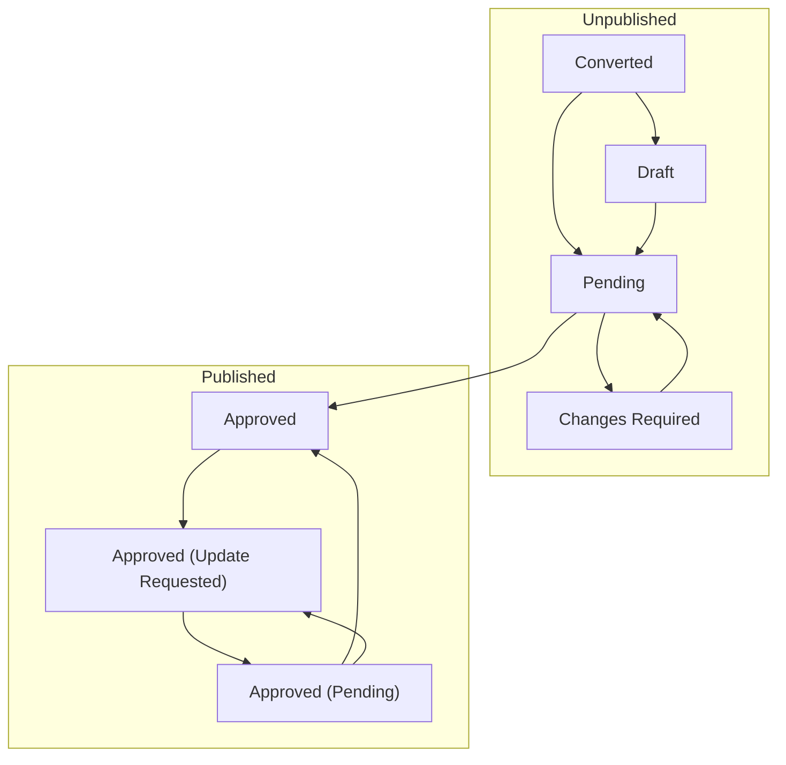

# deployments-registry-data

This repo provides backing data for the privacy deployments registry.
It is intended to be referenced by the front-end repo which is responsible for display.

## Workflow

In the schema, `status` is a required, enumerated field with the following allowed values:

- "Converted": Automatically converted from earlier collection of "cases".
- "Draft": Newly authored record; Author has responsibility for completing work.
- "Pending": Waiting for review by the board.
- "Changes Required": Board requires changes.
- "Approved": Yay!
- "Approved (Update Requested)": Small updates requested, but still can be displayed as "Approved".
- "Approved (Pending)": Small updates made; Awaiting re-approval by board.

These are the expected state transitions:



## Adding new deployment records

New records should be submitted as PRs.

- If you are outside the core team, you will make a [fork of the repo](https://docs.github.com/en/pull-requests/collaborating-with-pull-requests/working-with-forks/fork-a-repo#forking-a-repository),
and then make a [local clone](https://docs.github.com/en/pull-requests/collaborating-with-pull-requests/working-with-forks/fork-a-repo#forking-a-repository) of your fork.
- If you are a member of the core team, just make a local clone of this repo, rather than forking.

In your local clone:
- Copy `tests/good_deployments/template.yaml` to `deployments/` and give the copy a distinctive name. The organization, title, and year are good pieces of information to include in the file name.
- Inside the file, fill in as many of the fields as you are able.
  - "Tier 1" fields are required.
  - "Tier 2" adds more fields, and "tier 3" adds more detailed information.
  - If you are including "tier 2" and "tier 3" fields, try to fill out all the fields of that tier.
- Feel free to use comments (`#`) for notes to reviewers, but information about the deployment should not be in a comment.
- For some fields (for example `data_product_type`) we have an enumeration of expected values. If you need a new value, make changes to `deployments-schema.yaml`.

When your changes are saved:
- `git add .`
- `git commit -m 'SHORT DESCRIPTION HERE'`
- `git push`

Following the push, there should be a message in the terminal which includes a URL you can visit to start a PR on Github.
Follow this link, provide any information that will be helpful for the reviewers, and create your PR.

The reviewers should respond to your PR within a week.
- It may be merged as-is,
- or they may make small corrections and then merge,
- or they may have feedback for you about why it is not ready to be merged.

On your PR in github, you will see that tests are run.
These check that all files have the expected format.
If you see errors, you should correct them locally and then push again.
If you'd like to run tests locally, see the developer instructions below.

## Getting started as a developer

```bash
# Set up a venv:
python -m venv .venv
source .venv/bin/activate

# Install dependencies:
pip install -r requirements.txt

# Precommit hook:
pre-commit install

# Check one or more deployments:
python scripts/check.py

# Run all tests:
pytest
```

## Reviewing PRs

The tests will make sure the record is valid, so focus on things the computer doesn't do.
Is the description readable?
If this is a new contributor, spot check the original source for accuracy.
If a new enumeration value is proposed, consider getting more opinions before approving.

## FAQ

### Are there plans to support RDF or connect to `schema.org`?

Not currently. The plain YAML/JSON representation of the data is sufficient for our needs.
That said, we keep the principles of the [`schema.org` naming conventions](https://schema.org/docs/styleguide.html) in mind,
and distinguish nested types in the schema, instead of just having a flat list of fields.
We do use underscores in names for readability.
